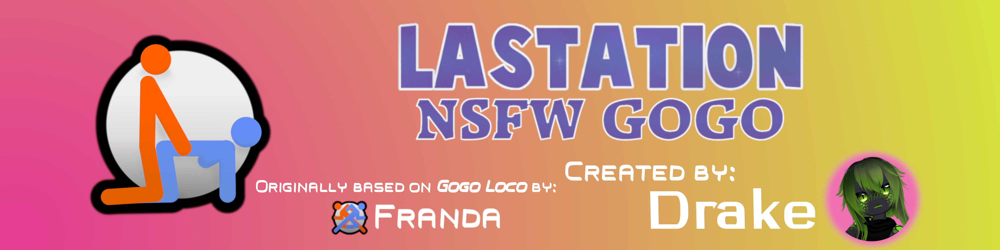

# NSFW Locomotion

A custom **NSFW** version of [GoGo Loco](https://teeth-fetch-gdl.craft.me/CxY701Ne9Ng5Ev) v1.8.3 (by [Franada](https://twitter.com/franadaVRC))

---------------------------------------

[![GitHub Downloads](https://img.shields.io/github/downloads/LastationVRChat/NSFW-Locomotion/total?style=for-the-badge&logo=data%3Aimage%2Fsvg%2Bxml%3Bbase64%2CPHN2ZyB4bWxucz0iaHR0cDovL3d3dy53My5vcmcvMjAwMC9zdmciIHdpZHRoPSI0MDAwIiBoZWlnaHQ9IjQwMDAiPjxzdHlsZT48IVtDREFUQVsuQntjb2xvci1pbnRlcnBvbGF0aW9uLWZpbHRlcnM6c1JHQn0uQ3tmbG9vZC1vcGFjaXR5Oi4xMTR9XV0%2BPC9zdHlsZT48ZGVmcz48bGluZWFyR3JhZGllbnQgaWQ9IkEiIHgxPSIxODg4LjkxNyIgeTE9IjY0Ny4wNjEiIHgyPSIyMDAwLjcwNyIgeTI9IjMzMzEuNDMxIiBncmFkaWVudFVuaXRzPSJ1c2VyU3BhY2VPblVzZSI%2BPHN0b3Agb2Zmc2V0PSIwIiBzdG9wLWNvbG9yPSIjZmZmIi8%2BPHN0b3Agb2Zmc2V0PSIuNzEiIHN0b3AtY29sb3I9IiNjM2MzYzMiLz48c3RvcCBvZmZzZXQ9Ii45OTciIHN0b3AtY29sb3I9IiM4OTg5ODkiLz48L2xpbmVhckdyYWRpZW50PjxmaWx0ZXIgaWQ9IkIiIHg9Ii0uMDMyIiB5PSItLjA2MSIgd2lkdGg9IjEuMDY0IiBoZWlnaHQ9IjEuMTIzIiBjbGFzcz0iQiI%2BPGZlR2F1c3NpYW5CbHVyIHN0ZERldmlhdGlvbj0iOS41OTYiLz48L2ZpbHRlcj48ZmlsdGVyIGlkPSJDIiB4PSItLjAzNSIgeT0iLS4wMzQiIHdpZHRoPSIxLjA3IiBoZWlnaHQ9IjEuMDY4IiBjbGFzcz0iQiI%2BPGZlR2F1c3NpYW5CbHVyIHN0ZERldmlhdGlvbj0iOS41OTYiLz48L2ZpbHRlcj48ZmlsdGVyIGlkPSJEIiB4PSItLjAxMyIgeT0iLS4wMzUiIHdpZHRoPSIxLjAyNyIgaGVpZ2h0PSIxLjA3IiBjbGFzcz0iQiI%2BPGZlR2F1c3NpYW5CbHVyIHN0ZERldmlhdGlvbj0iOS41OTYiLz48L2ZpbHRlcj48ZmlsdGVyIGlkPSJFIiB4PSItLjA3IiB5PSItLjAzIiB3aWR0aD0iMS4xNCIgaGVpZ2h0PSIxLjA1OSIgY2xhc3M9IkIiPjxmZUdhdXNzaWFuQmx1ciBzdGREZXZpYXRpb249IjkuNTk2Ii8%2BPC9maWx0ZXI%2BPGZpbHRlciBpZD0iRiIgeD0iLS4wMDciIHk9Ii0uMDA3IiB3aWR0aD0iMS4wMTQiIGhlaWdodD0iMS4wMTQiIGNsYXNzPSJCIj48ZmVHYXVzc2lhbkJsdXIgc3RkRGV2aWF0aW9uPSI3Ljg5NiIvPjwvZmlsdGVyPjxmaWx0ZXIgaWQ9IkciIHg9Ii0uMDA3IiB5PSItLjAwNyIgd2lkdGg9IjEuMDE0IiBoZWlnaHQ9IjEuMDE0IiBjbGFzcz0iQiI%2BPGZlR2F1c3NpYW5CbHVyIHN0ZERldmlhdGlvbj0iOC45OTQiLz48L2ZpbHRlcj48ZmlsdGVyIGlkPSJIIiB4PSItLjEwMSIgeT0iLS4wNTciIHdpZHRoPSIxLjIwMiIgaGVpZ2h0PSIxLjExNCIgY2xhc3M9IkIiPjxmZUZsb29kIHJlc3VsdD0iQSIgZmxvb2QtY29sb3I9IiMwMDAiIGNsYXNzPSJDIi8%2BPGZlR2F1c3NpYW5CbHVyIGluPSJTb3VyY2VHcmFwaGljIiBzdGREZXZpYXRpb249IjcwLjQ0Ii8%2BPGZlT2Zmc2V0IGR4PSIwLjAwMDAwMCIgZHk9IjAuMDAwMDAwIi8%2BPGZlQ29tcG9zaXRlIG9wZXJhdG9yPSJvdXQiIGluPSJBIi8%2BPGZlQ29tcG9zaXRlIG9wZXJhdG9yPSJhdG9wIiBpbjI9IlNvdXJjZUdyYXBoaWMiLz48L2ZpbHRlcj48ZmlsdGVyIGlkPSJJIiB4PSItLjA3NCIgeT0iLS4xMDUiIHdpZHRoPSIxLjE0OCIgaGVpZ2h0PSIxLjIxMSIgY2xhc3M9IkIiPjxmZUZsb29kIHJlc3VsdD0iQSIgZmxvb2QtY29sb3I9IiMwMDAiIGNsYXNzPSJDIi8%2BPGZlR2F1c3NpYW5CbHVyIGluPSJTb3VyY2VHcmFwaGljIiBzdGREZXZpYXRpb249IjcwLjQ0Ii8%2BPGZlT2Zmc2V0IGR4PSIwLjAwMDAwMCIgZHk9IjAuMDAwMDAwIi8%2BPGZlQ29tcG9zaXRlIG9wZXJhdG9yPSJvdXQiIGluPSJBIi8%2BPGZlQ29tcG9zaXRlIG9wZXJhdG9yPSJhdG9wIiBpbjI9IlNvdXJjZUdyYXBoaWMiLz48L2ZpbHRlcj48ZmlsdGVyIGlkPSJKIiB4PSItLjAxNSIgeT0iLS4wMTUiIHdpZHRoPSIxLjAzIiBoZWlnaHQ9IjEuMDMxIiBjbGFzcz0iQiI%2BPGZlR2F1c3NpYW5CbHVyIHN0ZERldmlhdGlvbj0iMy41ODIiLz48L2ZpbHRlcj48ZmlsdGVyIGlkPSJLIiB4PSItLjAwNSIgeT0iLS4wMDQiIHdpZHRoPSIxLjAxIiBoZWlnaHQ9IjEuMDA3IiBjbGFzcz0iQiI%2BPGZlR2F1c3NpYW5CbHVyIHN0ZERldmlhdGlvbj0iMy41ODIiLz48L2ZpbHRlcj48ZmlsdGVyIGlkPSJMIiB4PSItLjAwNCIgeT0iLS4wMDYiIHdpZHRoPSIxLjAwNyIgaGVpZ2h0PSIxLjAxMSIgY2xhc3M9IkIiPjxmZUdhdXNzaWFuQmx1ciBzdGREZXZpYXRpb249IjIuNjkyIi8%2BPC9maWx0ZXI%2BPGZpbHRlciBpZD0iTSIgeD0iLS4wMTEiIHk9Ii0uMDExIiB3aWR0aD0iMS4wMjMiIGhlaWdodD0iMS4wMjIiIGNsYXNzPSJCIj48ZmVHYXVzc2lhbkJsdXIgc3RkRGV2aWF0aW9uPSIyLjY5MiIvPjwvZmlsdGVyPjxmaWx0ZXIgaWQ9Ik4iIHg9Ii0uMDEiIHk9Ii0uMDEiIHdpZHRoPSIxLjAxOSIgaGVpZ2h0PSIxLjAxOSIgY2xhc3M9IkIiPjxmZUdhdXNzaWFuQmx1ciBzdGREZXZpYXRpb249IjMuNjM0Ii8%2BPC9maWx0ZXI%2BPC9kZWZzPjxnIGZpbHRlcj0idXJsKCNOKSI%2BPGVsbGlwc2UgY3g9IjE5ODcuMTY5IiBjeT0iMTk5OS43NjYiIHJ4PSIxNTYwLjE4MyIgcnk9IjE1NTMuOTcyIiBmaWx0ZXI9InVybCgjRykiLz48ZWxsaXBzZSBjeD0iMTk5Ny41MTYiIGN5PSIxOTk2LjI3MyIgcng9IjEzNjYuNDU5IiByeT0iMTM2Ny43MDEiIGZpbGw9InVybCgjQSkiIGZpbHRlcj0idXJsKCNGKSIvPjxwYXRoIGQ9Ik0xODE0Ljg2NCA0NDQuNDA4YzI2Ljk2NyA1NS40NjgtMTc1LjY3MSA4MS45MDUtMzkzLjc2MSAxNTIuMTI1LTIxNy42NTQgNzAuMDgxLTMxOS4xIDE3MC4xOTQtMzE3LjY4NSAxMDMuNzExczEwMS4xOTMtMjcxLjg5MyAyODUuNTU1LTMzMC4wMzMgMzc4LjE3NS0yLjM2NyA0MjguNjkgODUuNzM0IiBmaWx0ZXI9InVybCgjQikiLz48cGF0aCBkPSJNMzE5OS4yNiAzMzk5Ljc0Yy0xMS4xOCAxMzUuOTkzLTE0MC4wNzIgMjQzLjk4Ny0zMTIuODU5IDI0My45ODdzLTMzNy40NTQtMTQ3Ljg4Ni0zMzcuNDU0LTI4Mi42MzYgNTA2LjM4NS0yNDcuNTkyIDU1MC4wNDctMjg4Ljc1MmMzNi4zNzItMzQuMjg3IDEwMC4xOC0xNDIuNDg1IDEwMi45MzgtOTQuMjk1IDcuNTE1IDEzMS4yODEgNC43NSAzMzEuNDE2LTIuNjcyIDQyMS42OTZ6IiBmaWx0ZXI9InVybCgjQykiLz48cGF0aCBkPSJNMTg1MC41NzYgMzYzNi45OTdsLTExNTIuODMgMjYuMDljLTMxNS4yNDggMTMuNzAzLTM2NC41NjYtMjA4LjI5OS0zNTYuNi0zNzIuNTIxIDEwLjA2Ny0yMDcuNTU1IDIxNS4xMzMtMjY5LjI3MyAzMTIuMzc5LTI3OC42NzcgMzAuNzI2LTIuOTcxIDEzNy4zOTUtMTcuMjg0IDE4NS42OTktMy4xNDggMjM3LjA0MSA2OS4zNjUgOTkzLjkxNiAzNzAuMTMgMTIxOC40MTkgNTMwLjI1NCA0MS40OTcgMjkuNTk3LTEzNS4yNDUgOTYuOTI2LTIwNy4wNjcgOTguMDA0eiIgZmlsdGVyPSJ1cmwoI0QpIi8%2BPHBhdGggZD0iTTM2NjQuNjU4IDIxNDUuMDM3YzAgMTAyLjk3LTMwLjM1NSAyMDEuNzIzLTg0LjM4NiAyNzQuNTM0cy0xMjcuMzE0IDExMy43MTYtMjAzLjcyNyAxMTMuNzE2IDIxLjczNC0zNS45MzYtMzIuMjk4LTEwOC43NDcgMTc2LjQ4My0yMjMuNzM4IDE3Ni40ODMtMzI2LjcwOGMwLTIxNC40MjUtMjI4Ljc3MS0zNDEuMDQ1LTEyNC4zMDktMzQxLjA0NSAxNTkuMTIgMCAyNjguMjM3IDE3My44MjUgMjY4LjIzNyAzODguMjV6IiBmaWx0ZXI9InVybCgjRSkiLz48L2c%2BPGcgZmlsbD0iIzY0OGVmNSIgZmlsdGVyPSJ1cmwoI0kpIj48cGF0aCBkPSJNMTY5OC40NDcgMjI5Ni4yNzNsMTExMC42NTUtNS40MjNzOTguMzgtMTguNDQ2IDE1OC4xMTEgNDkuMTkgNDcuNDMzIDE0OS4zMjcgNDUuNjc3IDE3My4wNDQgMTQuMDU0IDc2OC41OTQgMTQuMDU0IDc2OC41OTQuODc4IDE0MC41NDMtMTQxLjQyMSAxNjAuNzQ2LTE2Mi41MDMtMTUzLjcxOS0xNjMuMzgxLTE3MS4yODctNS4yNy01NzcuOTgzLTUuMjctNTc3Ljk4M2wtMjA4LjkwNyAxMDguNTU3Yy0yMDQuMzQ4IDM4LjUwOS0xOTkuMDg2LTE5My4yNDEtMTY2LjE2Ny0yMTAuMDExbC00NzMuODkzLTIuMTk2IDEwMy41MjUgNjg2LjI3MnMyNi4wODcgMTcwLjE4Ni0xODEuMzY3IDE2My45NzUtNTY3LjcwMiAxMy42NjUtNTY3LjcwMiAxMy42NjVsNDYyLjExMi0yMjEuMTE4LTEzMi43MDYtNzcwLjYxM3MtNS44MDMtMTM5Ljk0NiAxNDYuNjgxLTE2NS40MTJ6IiBmaWx0ZXI9InVybCgjTCkiLz48ZWxsaXBzZSByeT0iMjg4Ljk5MSIgcng9IjI4NC42IiBjeT0iMjEzOC44ODgiIGN4PSIzMjIxLjk0OCIgZmlsdGVyPSJ1cmwoI00pIi8%2BPC9nPjxnIGZpbGw9IiNmNjAiIGZpbHRlcj0idXJsKCNIKSI%2BPHBhdGggZD0iTTEzNzguOTA0IDExMDEuNDkyYy00OC45MDMgNC41MjktMTEzLjQ3NSA2MC45Mi0xMTQuMjg1IDExMy4wNDVsLTI0LjIyNSAxMjAxLjI0MmM3Ljk4NSA5OS4yNjEgMTMwLjQzNiA3MzYuMDIzIDEzMC40MzYgNzM2LjAyM2wtNzIzLjg5MSA0My44MTNzLTExMS44MDMgMjkuODE0LTExNS41MjkgMTUyLjc5NSAxMzMuMjA4IDE0OC4xMTMgMjAxLjUzMSAxMzkuNDE4IDgyNi4wNjQtNTUuNTI5IDgyNi4wNjQtNTUuNTI5IDE0Mi42MDgtMTkuNTUyIDEzMi4zMy0xNjMuNjExYy04LjExNS0xMTMuNzM2LTE0Ny43NC04MDYuMzQzLTE0OC4wNjctODYxLjUyOC0uNzcyLTEzMC4zMzkgOS41NDgtNTkyLjYyNCA5LjU0OC01OTIuNjI0bDM4Mi42MDkgNzA0LjM0OXM3Mi43NzYgMTEwLjYzMiAxOTYuOTM5IDUwLjIwM2MxMzMuNjk4LTY1LjA2OSA1Ny41Mi0yMDcuNjgxIDEzLjYxOS0yODIuNTAyLTY0LjkwNy0xMTAuNjIzLTU1Mi42Ny0xMDEzLjkyLTYwOS4zMTYtMTExNi43NjktMjguMzY3LTUxLjUwMy01OS44NDMtNzcuMzkyLTE1Ny43NjQtNjguMzI0eiIgZmlsdGVyPSJ1cmwoI0spIi8%2BPHBhdGggZD0iTTE1NTMgNTIzLjAzN2EyODQuNiAyODAuNTE2IDAgMCAwLTI4NC42IDI4MC41MTYgMjg0LjYgMjgwLjUxNiAwIDAgMCAyODQuNiAyODAuNTE2IDI4NC42IDI4MC41MTYgMCAwIDAgMjg0LjYtMjgwLjUxNkEyODQuNiAyODAuNTE2IDAgMCAwIDE1NTMgNTIzLjAzN3oiIGZpbHRlcj0idXJsKCNKKSIvPjwvZz48L3N2Zz4K&logoSize=auto&label=DOWNLOADS&labelColor=c92078&color=e33b92)](https://github.com/LastationVRChat/NSFW-Locomotion/releases/latest)
[![Static Badge](https://img.shields.io/badge/Maintained%20By-KuryKat-696969?style=for-the-badge&logo=data%3Aimage%2Fpng%3Bbase64%2CiVBORw0KGgoAAAANSUhEUgAAAEAAAABACAMAAACdt4HsAAAC%2FVBMVEUAAADo2s2cW1BEOT7s491jAwgJCAhgNzipaVnZu7AICAgLCgrOsqiGKC6tSj0ICAjCpqMGBga4npkJCAgJBwgfFxXQpYnDopzIqZ8HBQUQEBCUMidrGh2fFSKzgXHu5drBpJOybmafQEXm0bugko%2BOenfBlocKCgoLCAmvl5UFBQUICAm7oZ7Hp56wmZW%2FfXQMCwvbtJ%2B7paH38%2Be0mJbp3s%2BWPT4TERLz696sdGimGidsGh63mJLr28%2BSHSDgwaZ%2BHh0IBwdtDRjmy7Hgxqp0HyN5DRBqBAcMDAycOjLs4NGnmpmrHirn29IHBgZeVk6FBg6okI68aF%2BTJCyVdWu%2BiXJ8dm9%2FExbGwr20XU%2BRV1epQUebGCPBlYOvc1%2BIJialRjGjh3B5GhqsGCoDAwMICAgLCgoFBQUNDQwQDw4VExJfAwoSERBZAANdAQViBg5kDBEYFhiFNTJ0ICEnIRxyGhuKPjjJvbwbGRgZFhRnCA0iHyJuFRhrERWVTUQdGxzFrKnAoZ3GlXs4LzFvBgy9qafDpKGZU0lJPUgiHBhqDBHFt7a8npu6h4aSSD5%2BKicnIiYuJyJ5IiJ2DBPBsLDDp6S9pKGjYlOIOjQsJyuxmpixdWCORD6MQTv18%2B2HJB6CDxWNDBV5AwnOwsGrjorHhoWchYKzfXK5emRcS1%2BAOTaDMS15JyY9IiMZCgvn1ce1pKHatZvDmZrHkZK3k5G8gW5gVlJQR0qHSUixKjQzKTCPGCB3FRlHBwveybrKs66%2BjHaDcW92amioaGJoYl42Mjl7Li6DAwrdzMe8sK7evqXPqqVsXnOCVVJULCyMLR%2Fr3dGdlrunmZjMpZaSiIOpgH6yc3akenWgbGi%2BUlZnTEtdFxspBwjSy8m8l5R%2FdI9oT2qGaGZuMDOoHipmJCNmExcsFBQ4BwrSsJnEm4eZX2G7ZGCkV1uaPDqfQyw0LilPFhhTBgrz7eG5xN6ZjazHnZ%2BIX113W1a2X0hcPT2KKTDc1tXjyKyJeaRvQUJZXYqBAAAAZHRSTlMAC%2F7%2B%2Fv7PB%2F753TkaFf7y768uKRYM%2Fdqnm1P%2B%2FPtraEEy%2Fv38%2FPjAfFX46eTAppeTiIB%2FalNSRi%2F%2B4te0l35mZWBNRjIu9fHu6dnUyMCJiIiCWz4p6efl2NbR0c%2FKysO%2Br6SSeaz3hAAAChlJREFUWMOElXdME3EUx6FSaRUJLkBlqCiJccW9R5xxJc4Y90ox8dLe5c47Yr07obbUlI7YQtvQFtra2qYt1jK0pAWRYktAhIiAqCEunGDExBljvAoimgov98f9%2Fnif933v9977hfXZrqUGBZ9L50IAnU4HQYhAMJsch1MrhDJaUtigFjlpa6LeSOdyegyAcDms8ydAICJ0cLG45PDBAAsPGAwePRWfw2EDEAThfpvNj3SAICgXkjAjZd6ggESjscDLpXdAAABCiMOvxpAOCKQOBM0VmxS%2FYDDASgNf4fXyRRBE4Igc1elg2EGxKIBI9zo1PipqIOeo3evXHFTgfBHuRVAQgWE%2FgmL%2BBLwDDPqj9iaJZdWA0cMnHd%2FgIQgunZKOgFR0JAHCYQeVv4jLxeWyJc7GbQMXcfVGvR4E6VTyCVTdZVoHBHJxNSwCCRRBbDBmcW4eKIXIlRv4ej4AcDiU4g6II1JjBFdEIFqhDEdk9k9uNcmMmDaQf4FMrqfcOWzqgwgAkOvsKCpXvyE1DMwOY1qS3Mfcv%2Ba%2FBVg9oaGhQMEOGgdgAyjIEcFaWGaHW0vuV7pSaTopTcOLW5awOjI0YOemCQ0FBSL2L4PYbBQFIIeUxGA1qcxpvl9Xw2yvrOSZ27zL1owICTj6rh%2BAoHKQcSEEU6mkmK41r2rqG5pFYtForG3Rm3atD6khOjpI4LI5QQAKcACZHEfsQo1GKKVNnSJudtuEKo2V97asbGFkSAlfot%2B9a2gQcYAgAaWaD1XLHHaMweNpVBKB6VNhoZtRyit1tZVtHTE2MiRAKCVgOcANEnCUIHAdBsNqaWltSlOl6UnhmQv1Fp7r7VtmW9mJEaNCANQYQwhgMIjTqYuEnj9%2FiLyh8sekNJ7zgzPz%2FLnqz%2FcllhSzoc3ctnTS2hAAnaZSRaiFuFxEtUL5%2Bxcv3n8qYZBSUqV57cyPuHfPJDFLtE1MQ%2BKzsqU7Q83kktrYUqmDlMtQOghAtjuFzz%2Ffa7WqaCorz9WYn1%2FzsdhcTKNVeAzPniXOXhwCkDTTFauRo3ZYLiK4BKlVq%2BunXs18XUlV%2FnvEh%2FyIuuLiovvauq6AITFxTsiRWjcnKZWUwRhMDQ5CI7W6VnGeySRmNsV%2B%2F5CfTxGKMptppZONBkN0%2F8UWHh42cV3vX%2FiqQ1JMyvDJ6n%2F4aEJha%2BuTB0POX66pYDojKEBNrjKVFwToZ89LXtcHSF4beWxiH20FjxTSmCqb28JQqervnD5163ZexqWs3BvZNTcyMpQ3nGaPUR84MjupzyVq2%2BKJMX2nsHkr4g%2F7aizaJ69LrfVnTp19fLmo6GNWpjhTnJUhEOSZ8uv0AW%2FAuHHv9t%2FNODdmVHzMn7ZYHL52Dq%2FilUr4Kpb39MGDr28k5uKizMz2EolSIBBcflrjlAU8CmN3t3F7r4C4maNmxEX1n%2BrFcyoi6nyvUmIJW3NLi%2FkXQFwiVkrac26%2BtJncfE8Bn19evqxHwjTTjvmmWf8shnkR6UsqInhajr%2BFEkABlEplia9TIhjC6n74lavooh6uR1fGjQkuoXjxtHjl%2FH9Xy4Lk5RVNVh7GQSe3tBeJlUpBSWenr%2BRu9ZB64P0dheObQtF9JW3o8LCwUTFxE2f0lmDRX8%2FLnlJrrEuL27s6m9uD6UtaijKqq%2B5erQdvuhV%2BVMEvv8Iatihsbtas%2BVkze7pi%2Bvh%2BgPWzXV%2Bia1N8apJBfiNvVt3Ly7tbdfGmICfHTbteTr1cIm55GmvY%2BC158%2BNz5%2Fb4sIaO%2FgMYMWmzNRBd2yhhVNb6FIWFVdUXz6Zdv5qTnZ5j%2BXqy3KP34uDLNNaQKVOTYnKn9QJYI8f0IyQXBwJdLmdTbWOju%2FABFf%2FatbvZ6enp2dnXWWkPJ3gKvMDLtOrcuFm5vy%2BR9bOssn2RKYrj%2BGhY2VXr8YW8IvIsKXlD8k4pUpI%2FYM65v3Oc0q2rvbeb7ugy7uShO5lRV5KMhiHbvmCWEYvMi2GSERK2XQ%2BhvFiFFJHfOefOzFrf2r3tPef7Od%2Fz%2B527xyBrpo6LsHHhuXOXMw8vPD5z6lIpnc8rN%2F564hHS%2F%2F74%2FLMHp3wppWfMKGyYFANSRu%2B4MizYtOrta8u%2FX0pPfnb48xBah4eLeWRUqMdp%2F6NrF48f3He1kE4XVm5YFicw%2FinD9O0WIYTag6UX1288r9frR4p9xWLfIpPVaozyl58e3HlRGBoaSp86tHLHLAnACGTe3NY1NXvpCop%2BYOA8On3jxrG%2BYl%2Ff8K9iPUnArIXMNCu3p%2BE3UhhKD%2BQHBrauR4CMsDzexJw1KwCAKgl%2BZeG7G9%2BLxeLwr777QAHCpM35h7sHrh49eiCTOZkfyD9dMlcCUoaBxws1e6aySga%2BpuzRuxN%2FFi%2BqH6nfFxwoi6oUhP%2FmwNF0JpM5gF9pvhIDcBPdmKGni1IiRZGAwcTHm3sJy%2BbGctyxGA1d1xGe%2BSZTQEDh%2FKmnpYFopgJoQg%2F6CUXFBMPof%2FTzIICTdRizsiSsghlFVf4jk04fLVVCP7x7l%2FaukQBFoEu6VHxFkA9ivH719mA%2FMMvKWg41y7ZdLrvc8O%2FdrfgihTK5QT0NQBEGaNN2lALseY8AACEYMYPAbnxrDJo400BzbCIMz0EsYARdSpoD%2Fbde7UeAxJpRMNgYCUKXE6PlJ3I2JOQGDPmCMrX1NsAAz7nyNuBIML0oKP8ecf2aG5okXp7ZOBkkICWlAHbk8g7AML3Xt3yXQrIclJvNZs11Q8%2FkQHR6kdWAVEsMiJ%2F0GFApkN0VHz5%2BME0eNZuj30a%2FNWyHC5CScEIFw%2Bc4gCEIiTzOQHAVAINVX732XNctf%2F3aHM0GgZBsHOZMF1qWn3YAVMhd4KhpUgAJIObLK4yJcOTrSFD1wkGQdhubiqR272gLYHAwCIoJkP2UfiDZqqDgj5aT5ZHATVI8U9lcznKYDogaBwCOOEVg8UGWIeVWa%2BUg2fgdhr6w0G3ZQh%2FWVExItAJQiZMEAKL2R%2FVfdhBU3UaV%2Br6VQzeylQxD%2B7tjADB8oQEEVIkMiaHCswddVk0C98eymF2htUhvd2%2Fvkh4NIJykNCDG6w9CmJ4dJYHWIm5ZDmh7%2B%2BB0ze7pwf%2FHuoWgHi3A8nlLtwjBTdv2zCgEgeGzHGg7uSZsSyipFuIGOgmM7s1TE0ux39zGPUeOk7VyWSydtre1ZE4bQEDXNA6wQt52c7dtAVlO8Jx259DeUffsRBsAVGeiOv9mPTBPtZmCndPxtb2t9l2g%2FEo4h%2BBP15w2QBEE%2F295NdKKkMKOaT81DFnjeTF5pgag9PITAWSmvgsoxG2RHPT39rQAY46ap4s3UbgYLFXzWMtPNBjfam0fvqcn6uUn%2BjGcLkM8in4lvKNi7dw9kCRqqrZUBv8NgNlUudrrK42%2F6metXb3LxzE9wutH%2BAQAgc1yq13LO359y3a0bhGJAXSsNLnCJgDomkTiLzEB175tBl0%2BAAAAAElFTkSuQmCC&labelColor=c92078&color=e33b92)](https://vrchat.com/home/user/usr_88edd638-41f7-4b86-81d2-425589e38828)

> [!IMPORTANT]
> **Do NOT include both NSFW GoGo Loco and regular GoGo Loco in the same project, as they share similar Menu/Layer names and will conflict.**

---------------------------------------

## Features

This project has several different versions, that works for Unity 2019 & 2022, download the one that you need for the Unity version that you're using! We have a version that includes all features, and a version with just poses for a reduced upload size (Questie feelings)

- Unity 2022
  - [Full Version (Emotes + Poses)](https://github.com/LastationVRChat/NSFW-Locomotion/tree/2022/full)
    - Custom AFK Animation (by [WetCat](https://wetcat.gumroad.com/))
    - Custom Turntable Animation (by [LastationVRChat](https://github.com/LastationVRChat/))
    - NSFW Poses (by [LastationVRChat](https://github.com/LastationVRChat/))
    - NSFW Emotes (by [LastationVRChat](https://github.com/LastationVRChat/))
    - Streamlined Menu that matches the latest GoGo Loco Menu Layout
  - [Poses Version (Poses Only)](https://github.com/LastationVRChat/NSFW-Locomotion/tree/2022/poses)
    - Custom AFK Animation (by [WetCat](https://wetcat.gumroad.com/))
    - Custom Turntable Animation (by [LastationVRChat](https://github.com/LastationVRChat/))
    - NSFW Poses (by [LastationVRChat](https://github.com/LastationVRChat/))
    - Streamlined Menu that matches the latest GoGo Loco Menu Layout
- Unity 2019
  - [Full Version (Emotes + Poses)](https://github.com/LastationVRChat/NSFW-Locomotion/tree/2019/full)
    - Custom AFK Animation (by [WetCat](https://wetcat.gumroad.com/))
    - Custom Turntable Animation (by [LastationVRChat](https://github.com/LastationVRChat/))
    - NSFW Poses (by [LastationVRChat](https://github.com/LastationVRChat/))
    - NSFW Emotes (by [LastationVRChat](https://github.com/LastationVRChat/))
    - Streamlined Menu that matches the latest GoGo Loco Menu Layout
  - [Poses Version (Poses Only)](https://github.com/LastationVRChat/NSFW-Locomotion/tree/2019/poses)
    - Custom AFK Animation (by [WetCat](https://wetcat.gumroad.com/))
    - Custom Turntable Animation (by [LastationVRChat](https://github.com/LastationVRChat/))
    - NSFW Poses (by [LastationVRChat](https://github.com/LastationVRChat/))
    - Streamlined Menu that matches the latest GoGo Loco Menu Layout

> [!NOTE]
> Currently does not support GogoLoco Beyond.
>
> We do plan, however, to add support in the future!

## Installation

Since this project includes installer prefabs for [VRCFury](https://vrcfury.com/), the process of installation is quite easy. Follow these steps:

1. [Download the Latest Release](https://github.com/LastationVRChat/NSFW-Locomotion/releases/latest).
2. Import the latest release into your project.
3. [Add VRCFury to the VRChat Creator Companion](https://vrcfury.com/download).
4. Add the latest [VRCFury](https://vrcfury.com/) to your project with the VRChat Creator Companion.
5. Drag the respective prefab that you want to use into your avatar's hierarchy:
   - `GogoLoco All (VRCFury).prefab` **if Write Defaults = OFF**
   - `GogoLoco All WD (VRCFury).prefab` **if Write Defaults = ON**
