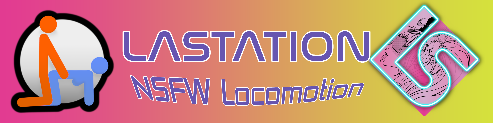
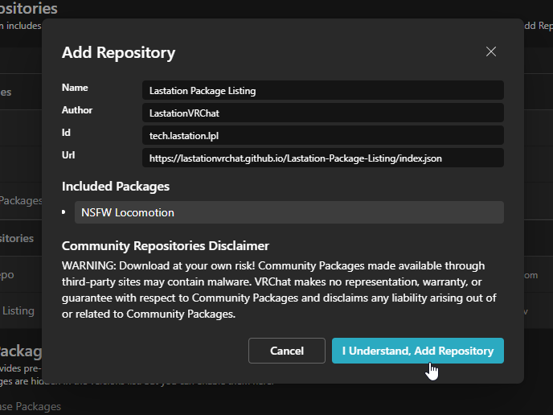
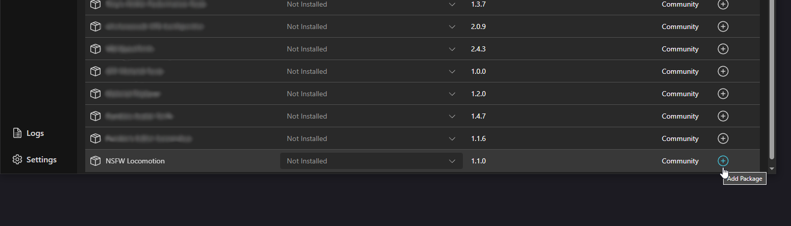
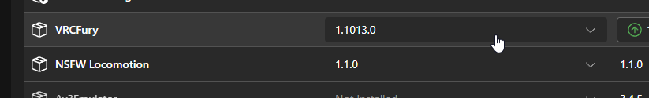
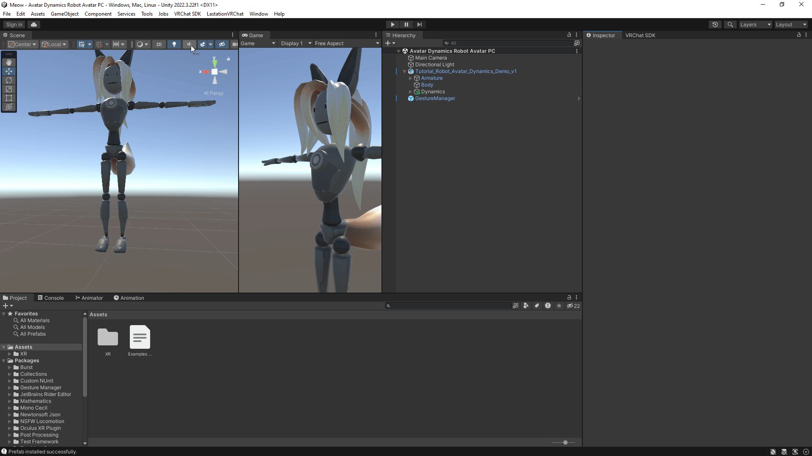

# NSFW Locomotion

A custom **NSFW** version of [GoGo Loco](https://teeth-fetch-gdl.craft.me/CxY701Ne9Ng5Ev) v1.8.3 (by [Franada](https://twitter.com/franadaVRC))

---------------------------------------

NSFW Locomotion for VRChat Avatars is a highly customizable and dynamic movement solution designed to elevate the functionality and immersive experience of adult-themed avatars. Built on the foundation of the renowned "GoGo Loco" system by Franada, this enhanced locomotion framework retains all the core features of GoGo Loco while introducing two versions for lightweight (pose only) or standard (emotes + poses).

> [!IMPORTANT]
> **Do NOT include both NSFW GoGo Loco and regular GoGo Loco in the same project, as they share similar Menu/Layer names and will conflict.**

---------------------------------------

## Features
- **GoGo Loco Replacer:** Adds all base GoGo Loco functions, ensuring seamless integration and a familiar user experience.
- **IK Integration:** Full Inverse Kinematics support ensures realistic body positioning and interactions with objects and avatars.
- **Custom Animation Slots:** Easily integrate your own animations or adapt the system to your avatar’s unique requirements.
- **Smooth Transitions:** Enables fluid transition between poses and emotes, enhancing the realism and responsiveness of avatar interactions.
- **Motion Time for Two-Frame Poses:** Utilizes motion time to smoothly float between two frames, enabling subtle actions within the pose, such as spreading legs or shifting body weight.
- **One Click Install:** Simplifies the setup process using VRCfury and our custom editor script, which automatically assigns the NSFW Locomotion prefab to your avatar with a single click.
- **Two Specialized Versions:** 
  - **NSFW Locomotion(Poses Only):** Focuses on pose-based locomotion, providing responsive and fluid movements for avatars in adult-themed environments, while maintaining a lower file size. This version is ideal for creators seeking lightweight, pose-driven interactions.
  - **NSFW Locomotion(Emotes + Poses):** Extends the functionality to include full emotes, dynamic movements, and custom animations alongside the pose features. This version offers a richer interaction experience for users and avatars, perfect for immersive roleplay and interaction in NSFW-themed worlds.

NSFW Locomotion is available for both Unity 2019 and 2022. Choose the version that matches the Unity version you're using. There are options for a full version with all features or a poses-only version for a reduced upload size.

### Unity 2022 Versions

- [Full Version (Emotes + Poses)](https://github.com/LastationVRChat/NSFW-Locomotion/tree/2022/full)
- [Poses Version (Poses Only)](https://github.com/LastationVRChat/NSFW-Locomotion/tree/2022/poses)

### Unity 2019 Versions

- [Full Version (Emotes + Poses)](https://github.com/LastationVRChat/NSFW-Locomotion/tree/2019/full)
- [Poses Version (Poses Only)](https://github.com/LastationVRChat/NSFW-Locomotion/tree/2019/poses)

> [!NOTE]
> Currently does not support GoGoLoco Beyond, but future updates may add support.

---------------------------------------

## Installation

### Preferred Installation Method: Using VRChat Creator Companion (VCC)

We highly recommend using the [VRChat Creator Companion (VCC)](https://vcc.docs.vrchat.com/) along with the [Lastation Package Listing (LPL)](https://lastationvrchat.github.io/Lastation-Package-Listing/) for easy installation and updates.

1. **Add the LPL to VCC**:
   - Go to the [VCC](https://vcc.docs.vrchat.com/) and add the [LPL](https://lastationvrchat.github.io/Lastation-Package-Listing/) as a custom package repository.

   

2. **Install NSFW Locomotion**:
   - Find the NSFW Locomotion package in the LPL and install it via VCC.

   

3. **Ensure VRCFury is Installed**:
   - Make sure [VRCFury](https://vrcfury.com/download/) is installed via VCC. NSFW Locomotion requires VRCFury for seamless setup.

   

4. **Select Your Version and Install**:
   - In Unity, navigate to the toolbar: **LastationVRChat => NSFW Locomotion**, then select your avatar and choose either the "Full Version" or "Poses Version."

  

### Alternative Installation Method: Manual Installation

If you prefer the manual installation process, you can still follow these steps:

1. [Download the Latest Release](https://github.com/LastationVRChat/NSFW-Locomotion/releases/latest).
2. Import the latest release into your Unity project.
3. [Download VRCFury](https://vrcfury.com/download) and add it to your project.
4. Drag the respective prefab into your avatar's hierarchy:
   - `GogoLoco All (VRCFury).prefab` **if Write Defaults = OFF**
   - `GogoLoco All WD (VRCFury).prefab` **if Write Defaults = ON**

> [!WARNING]
> The manual method does not include the automated updates and features provided when installing through VCC.

---------------------------------------

## Support and Feedback

Enjoy using NSFW Locomotion! If you encounter any issues or have suggestions, please visit the [Issues page](https://github.com/LastationVRChat/NSFW-Locomotion/issues) or join us on [Discord](https://discord.gg/lastation).
